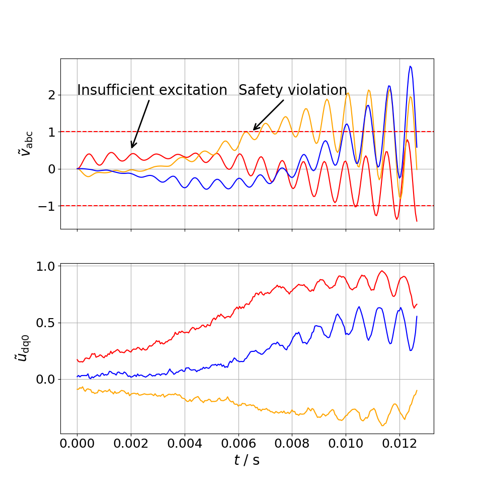
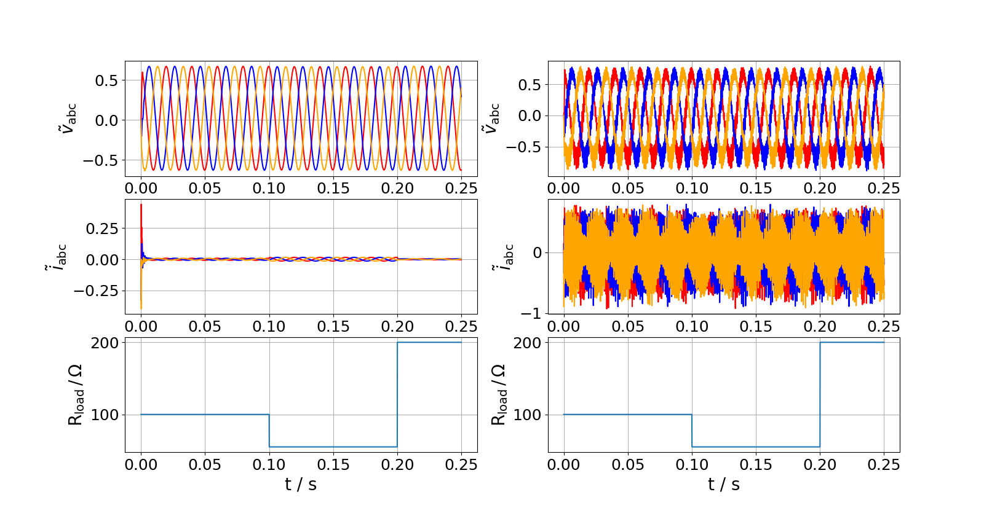

# MPC-based-exploration-for-reinforcement-learning-in-power-electronics-systems

Reinforcement learning (RL) controllers relying on exploration techniques during training
to sufficiently excite the system to learn an optimal policy. Deep deterministic policy
gradient, a well-known RL algorithm, uses ornstein–uhlenbeck process superimposed on
the action given by its deterministic policy. This method of exploration is neither guided
nor temporally correlated, leading to a need for longer training and is data inefficient.
Furthermore, the random nature of this exploration is a threat to safety-critical systems,
such as electrical power grids, and does not provide a framework to ensure well-balanced
state space coverage.
To address this issue, model-based predictive control (MPC) technique is used to generate
targeted-exploration trajectories to obtain information-rich samples. Using this
improved method of exploration, an upgraded RL agent is designed and then deployed on
grid-forming 3-phase voltage source inverter with unknown resistive load.

[Model-based Exploration for Reinforcement Learning in Power Electronic Systems](./Model-based-Exploration-for-Reinforcement-Learning-in-Power-Electronic-Systems-1.pdf)

